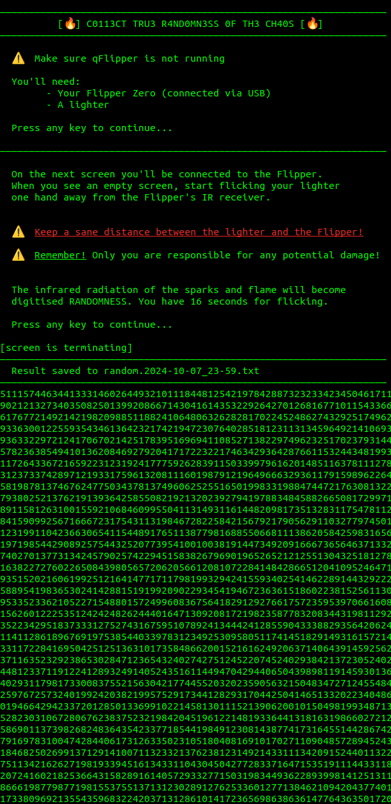

# Flipper, Fire, RNG!

```
⚠️   Disclaimer   ⚠️

By using this software and by following all the enclosed instructions you acknowledge 
that it is provided "as is" without any warranties, express or implied. 
The user assumes all responsibility for any consequences, including but not limited to damage, 
loss of data, or other issues arising from the use of this software 
or following the enclosed instructions. The developer shall not be held liable for any claims, 
damages, or losses related to the use of this software and instructions.
```

## Flipper Zero + a lighter = true random number generator!

1. The flame of a lighter or a candle emits infrared radiation.
2. Flipper Zero has an IR sensor.
3. The flame of a lighter is hardly predictable by nature.
4. Combine the two and get a true Random Number Generator!

This repo contains a script which does exactly that. 

## How to use
Currently there's only a version for Linux.

1. Make sure you have the following programs installed:
	- sed
	- tr
	- screen
2. Get a lighter (BiC, Zippo, etc).
3. Make sure your Flipper Zero is connected to the computer.
4. Stop `qFlipper` or any other software on the computer that talks to the Flipper.
5. `chmod +x ffr`
6. `./ffr`
7. Follow instructions on the screen.
8. Once you see a blank screen, start flicking your lighter at a short distance from the Flipper, so that sparks and flame would be visible to the IR sensor.
	- **NB:** Don't burn your Flipper!
	- **NB:** Don't set anything around your on fire!
	- **NB:** Be very carefulg!
9. Flipper will record the infrared radiation as random digital data.
10. You have 16 seconds to generate random data with the lighter
11. Once the time runs out, the script cleans up the data and saves it to a file in the current working directory

## Results
