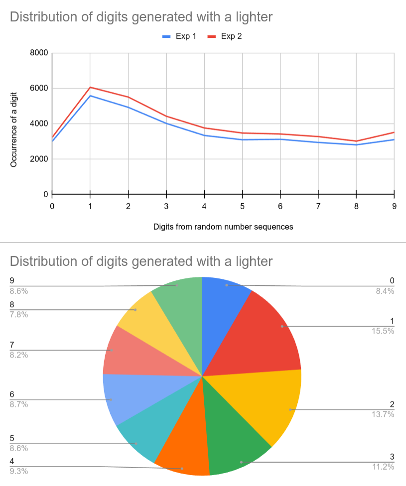

# Flipper, Fire, RNG!

```
⚠️   Disclaimer   ⚠️

By using this software and by following all the enclosed instructions you acknowledge 
that it is provided "as is" without any warranties, express or implied. 
The user assumes all responsibility for any consequences, including but not limited to damage, 
loss of data, or other issues arising from the use of this software 
or following the enclosed instructions. The developer shall not be held liable for any claims, 
damages, or losses related to the use of this software and instructions.
```

## Flipper Zero + a lighter = true random number generator!

1. Flipper Zero has an infrared transceiver.
2. The flame of a lighter or a candle emits infrared radiation.
3. Most flames are hardly predictable by nature.
4. Combine the 3 above and get a True Random Number Generator!

This repo contains a script which does exactly that. 

## → [🔥 Live Demo on YouTube 🔥](https://www.youtube.com/watch?v=s5Ac3KxHHsc) ←

- - - - - 


## How to use
Currently there's only a version for Linux.

1. Make sure you have the following programs installed:
	- sed
	- tr
	- screen

2. Set Log Baud Rate to `230400` by navigating on your Flipper Zero to:
```
	Settings -> System -> Log Baud Rate: 230400
```
3. Get a lighter (BiC, Zippo, etc).
4. Make sure your Flipper Zero is connected to the computer.
5. Stop `qFlipper` or any other software on the computer that talks to the Flipper.
6. `chmod +x ffr`
7. `./ffr`
8. Follow instructions on the screen.
9. Once you see a blank screen, start flicking your lighter at a short distance from the Flipper, so that sparks and flame would be visible to the IR sensor.
	- **NB:** Don't burn your Flipper!
	- **NB:** Don't set anything around your on fire!
	- **NB:** Be very careful!
10. Flipper will record the infrared radiation as random digital data.
11. You have 16 seconds to generate random data with the lighter.
	- You can adjust the time of experiment by executing `./ffr <NUMBER_OF_SECONDS>`.
12. Once the time runs out, the script cleans up the data and saves it to a file in the current working directory.


## Some statistics
The project contains files [data1.txt](static/data1.txt) and  [data2.txt](static/data2.txt) with random numbers collected by running `ffr 150` and flicking 2 different BIC lighters.
The random numbers were then checked with [dieharder RNG tests](https://manpages.ubuntu.com/manpages/xenial/man1/dieharder.1.html) and results were generally satisfying:
- [Result 1](static/dieharder_result1.md)
- [Result 2](static/dieharder_result2.md)

Interestingly enough, distribution of individual digits in the data is not uniform. `1`, `2` and `3` happen to occur more often than the other digits. Nevertheless, the dieharder tests don't see it as a problem. You can run a digit frequency test using `./freq YOUR_FILE_NAME`.

Below are frequency graphs based on [data1.txt](static/data1.txt) and  [data2.txt](static/data2.txt):


